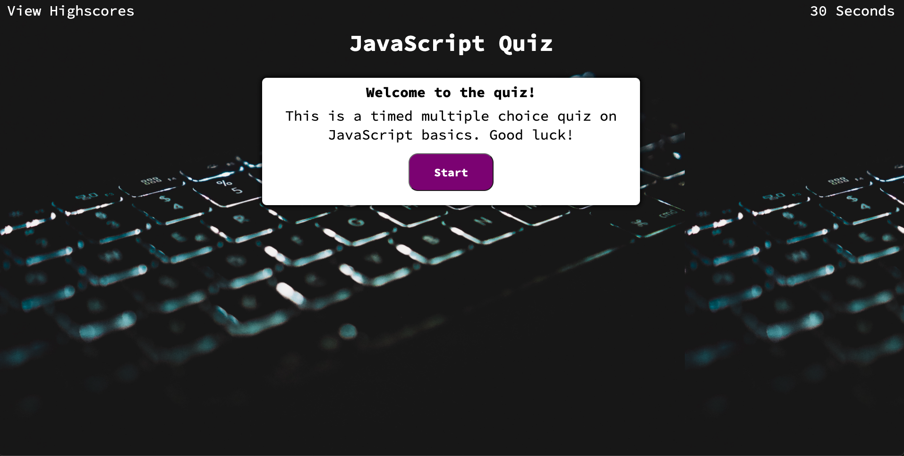
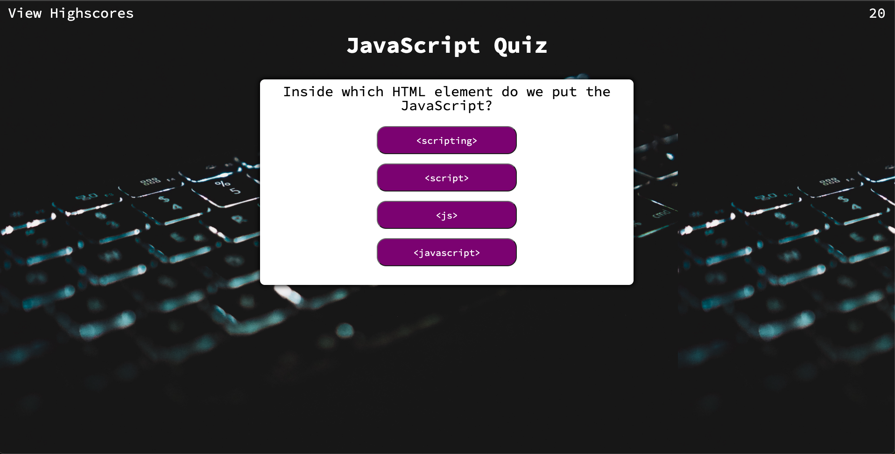
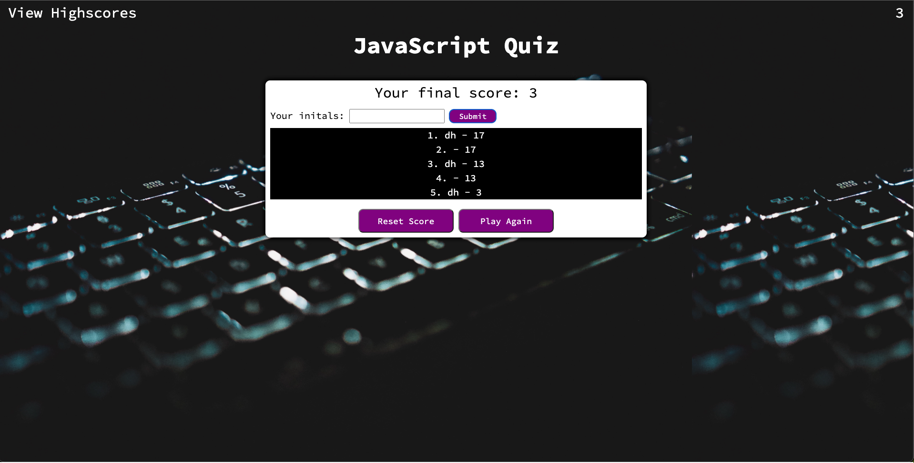

# code-quiz
## Description
- My motivation for this project was to be able to use JavaScript properly to be able to control all aspects of a website.
- I built this project to expand my knowledge on JavaScript, HTML, and CSS.
- This application solves the problem of having a fun way to study and learn JavaScript concepts.
- I learned a lot about event listeners, functions, and how to target HTML elements with JavaScript.
## Installation
To install this application, simply click on this link to open it in the browser.
https://dylanhoryza.github.io/code-quiz/
## Usage
To use this application, click on the start game button. Once clicked, the game timer will start and you must begin answering the questions.
You can enter your initials to log your highscore and also view your highscore with the link in the top left of the page. The following screenshots
demonstrate how to use the application.
   
  
  
  
   
## Credits
My tutor Mila Hose helped me with the functions related to determining whether the answer was correct or incorrect, as well as setting me on the right 
path with using local storage.
## License
N/A

